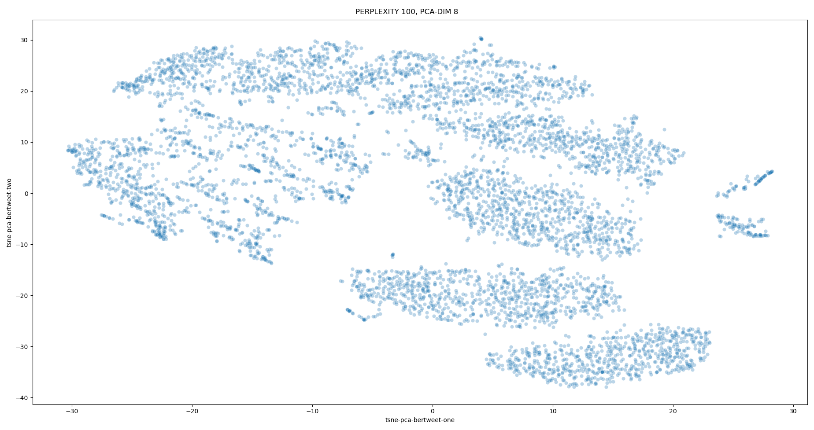
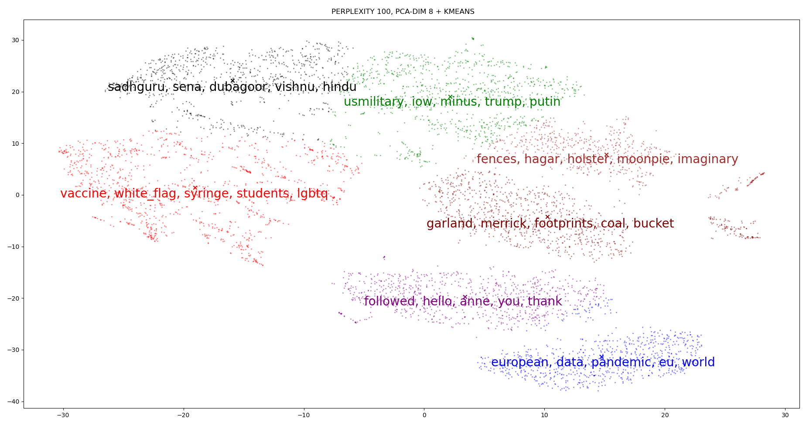

# SUMMARY 

    1. Try to learn whether a tweet is viral or not (by number of likes)
    2. Try to learn how to classify tweet responses into the following categories
        0. Denial
        1. Support
        2. Comment
        3. Queries
    
    The original data is labelled as follows
    0. Explicit Denial
    1. Implicit Denial
    2. Implicit Support
    3. Explicit Support
    4. Comment
    5. Queries
    Just combine explicit, implicit into 1 category.
    
    Additionally, there's some work on learning if a tweet is viral. 
    Use retweets and favorite counts as labels
    
# TO DO LIST / RESULTS
    

# WHAT'S TRIED SO FAR
    [x] vanilla BERT, with pairwise encoding of tweets (main_v2.py)
    [x] bertweet, pairwise encoding, + topic + interaction_type (main_multitask.py)
    [ ] bertweet, pairwise encoding, + topic + interaction_type + added semeval17 data (main_multitask.py) need to fix a mapping bug here
    [x] bertweet, pairwise encoding, + topic + interaction_type (main_multitask-sequential.py) doesnt work well
    
    [x] bertweet, individual encoding, + topic type + user follower count (main_multitask_user_features.py)
    [x] bertweet, individual encoding, + topic type + user follower count + user keywords (main_multitask_user_features_keywords.py) (seems to work best)
    
### **Data:**
    Here's how the original data looks like.

        
    There are 5221 tweet pairs in the raw data. 
    However, there are a lot of tweets with missing text. Removing them leaves 4271 tweet pairs
    (plotted as filtered above)
    After using tweets where the target tweet's user characteristics are still online, the number of tweet pairs is further reduced to 3440
        2752 training pairs (80%) where 4-fold validation is done
        688 test pairs (20%)
    Whether a post is viral is defined as being in the top 20% by the count of likes. I chose likes over number of retweets, but it really shouldn't matter. They are highly correlated (shown below in a log-log 2d histogram).
    

    
    

### **Procedure:**
Before training, each target tweet's author's latest 20 posts are scraped to find top relevant keywords. 
Stopwords are removed.
TFIDF calculated to find top X number of keywords to represent a user.
Keywords are joined together, then fed into bertweet alongside post text content

Optimizer: ADAM
Loss function: inverse frequency weighted cross entropy for virality and stance
Sampling during training: inverse frequency weighted
Split the training data into 4 folds.
Training terminates whenever either (a) or (b) happens
    a. no improvement in dev set F1 score for 20 epochs.
    b. 200 epochs are done

### **Model:**

TODO. Draw how it looks like

### **Results:**

Best results gotten in experiment 95. 
Each result shown here is the average F1 score across 4 runs of 4-fold cross validation.
For stance, this trained model is not the best and loses to others by ~1-2% points.
For viral task however, it is the best.

|        |Deny  |Support|Comment|Query |Macro F1 Avg|Accuracy
|--------|:---- |:-----:|:-----:|:----:|:----------:|:------:|
Dev set  |0.6446|0.5497 |0.4927 |0.4686|0.5389|56.55%
Test set |0.6738|0.5665 |0.4816 |0.5978|0.5799|58.43%

|        |Not Viral|Viral |Macro F1 Avg|Accuracy
|--------|:-------:|:----:|:----------:|:------:|
Dev set  |0.8778   |**0.5647**|0.7212      |80.93%
Test set |0.8971   |**0.6168**|0.7570      |83.80%|

This is the best score for viral datasets

### **Ablation:**

Sequentially subtract away features
keywords
followers
text
keywords-followers
keywords-text
text-followers
keywords-followers-text

### **Misc stuff:**

An illustration of top X keywords to represent a user. 
    1. Words are extracted by TFIDF. 
    2. Generated vectors with Bertweet's embedding layer.
    3. PCA analysis to decompose to 8 most important dimensions
    4. Generate T-SNE plot in 2D

### **Remarks:**

BERTweet is much better than vanilla BERT at understanding tweets. However, the main drawback is when its tokenizer preprocesses tweets, it removes info about usernames. Some information is lost. 
For example, 

Days after our baby girl was born, I kissed my wife goodbye before surgery and neither of us knew if she would be coming back. We just wanted her to survive — 10 months later, she's in the #Wimbledon final. @USER will be holding a trophy again... HTTPURL HTTPURL