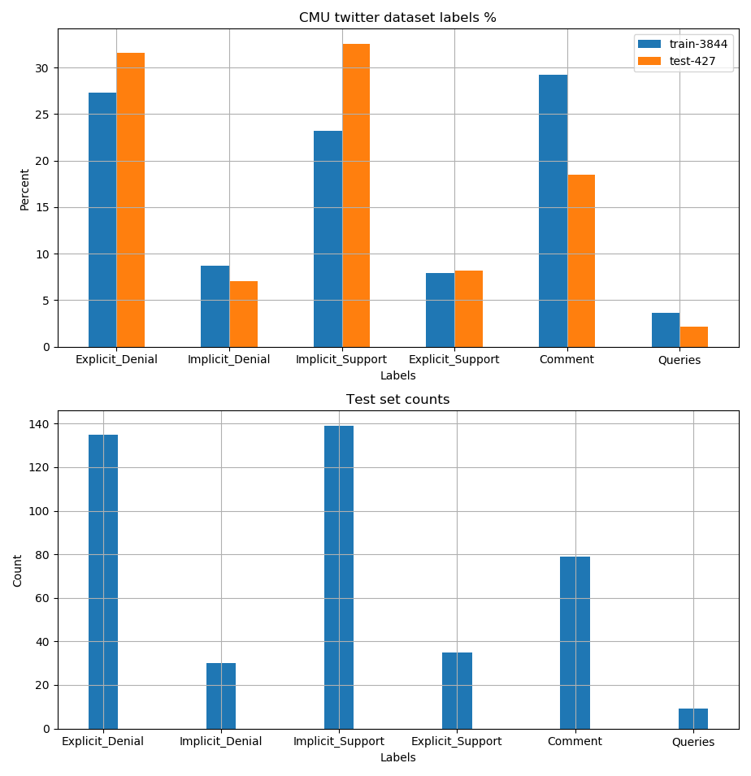
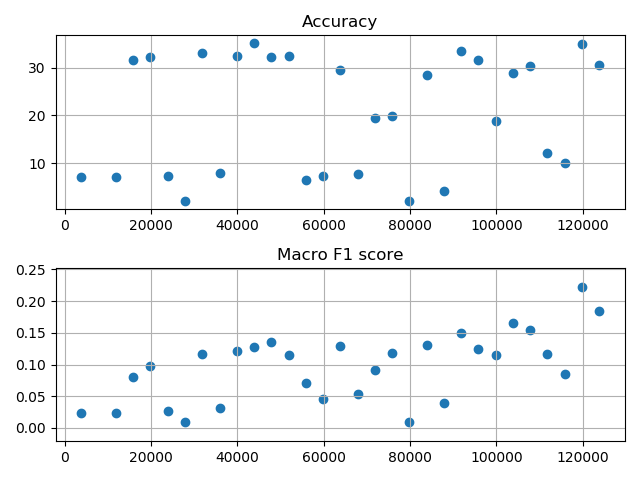

# TO DO LIST / RESULTS
    To try to learn how to classify tweet responses into the following categories
    0. Explicit Denial
    1. Implicit Denial
    2. Implicit Support
    3. Explicit Support
    4. Comment
    5. Queries
    
    Will try to use BERT to do the task    
    
## **Task 0: Preprocessing Data**
    [x] Visualize category labels density
    [x] Filter the NaNs in either parent tweet or child tweet
    [x] Tokenize tweet pairs
    [x] Convert labels into numbers
    [x] Split the dataset into training and test sets
    [x] Ensure test dataset label density is similar to main dataset's
    [x] Save the tokenized tweets into binaries    

### **Data:**
    Here's how the data looks like.

        
    There are 5221 tweet pairs in the raw data. 
    However, there are a lot of deleted tweets.
    There are 4271 tweet pairs in the cleaned data.
        ~90% training set (3844)
        ~10% test set (427)
    Always fix the test set as the last 427 samples

    After splitting into training and test sets, the densities still look OK.
    

## **Task 1: Try to classify using BERT**
    [x] Change the F1 metric to macro F1 score
    [x] Build a simple BERT first
    [ ] Improve old code for saving training steps
    [x] Save intermediate models

## **Task 3: Try to improve classifier**
    [ ] Stack layers after generic BERT
    [ ] Use the bigger BERT model
    [x] Try ADAM instead of SGD
    [ ] Include the "times labeled" field
    [x] Weigh the cost function

### **Models:**

### ModelA0
    BERT ==> Dropout1 10% ==> Linear1
    Loss: Cross Entropy Loss, flat weights
    SGD lr=0.001, momentum=0.5
    3000s for 30 epochs. Doesnt train very well
    
### ModelA1
    BERT ==> Dropout1 10% ==> Linear1
    Loss: Cross Entropy Loss, 
        weights = sum_counts / (number of labels in each category),
        then divide by mean weight 
    SGD lr=0.001, momentum=0.5
    
    
### ModelA2
    BERT ==> Dropout1 10% ==> Linear1
    Loss: Cross Entropy Loss, 
        weights = sum_counts / (number of labels in each category),
        then divide by mean weight 
    ADAM: lr=0.001, momentum=0.5

### **Training algo:**
    SGD
        Learning rate = 0.001
        Momentum = 0.5
        Minibatch size = 40
    ADAM
        Learning rate = 0.001

### **Hardware used:**
    GPU: RTX 2080 Super (8Gb RAM)
    CPU: Ryzen 3900 (12 cores 24 threads)
    1 epoch takes ~1.5 min for modelA
    Peak GPU RAM usage is ~7/8 Gb. Dont use maximum to give some buffer

### **Results:**

### ModelA0
    The model doesn't really train at all. The output layer seems to swing 
    between results. It labels everything in 1 class or another. Perhaps this 
    is caused when it looks at a subset of training data from only 1 class. 
    Might be solved by either increasing momentum, increasing minibatch size, 
    or carefully tweaking the cost function.
    
    

    
### ModelA1
    3000s for 30 epochs. Loss starts to go down only a tiny bit. 
    Try to go further with this later

    

    
### ModelA2
    The model doesn't really train at all, similar to ModelA0. 
    
    

    
### **Remarks:**
    How to deal with abbreviations? Some examples
    - NRA
    - ROFL
    - LOL
    

# Concepts/tools used for this exercise
    
    pytorch:
        ~~how to build NNs~~
        ~~how to train and use NNs~~
        ~~huggingface transformers library~~
    CUDA stuff:
        ~~moving things to GPU only when needed~~
        ~~deleting references to objects no longer needed~~
        ~~release memory by calling cuda.emptying_cache()~~
        ~~if all else fails, backup models, data, then reboot python kernel~~
    General stuff:
        ~~Practice proper file handling to prevent overwrite accidents~~
        ~~Saving and caching tokenizer outputs. Tokenizing the entire dataset is damn slow. ~3.5hr~~
