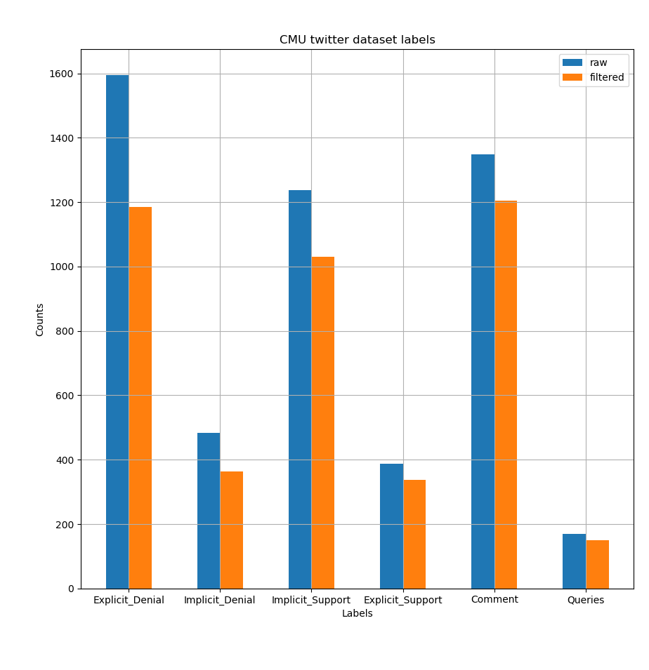

# SUMMARY 
    To try to learn how to classify tweet responses into the following categories
    0. Denial
    1. Support
    2. Comment
    3. Queries
    
    The original data is labelled as follows
    0. Explicit Denial
    1. Implicit Denial
    2. Implicit Support
    3. Explicit Support
    4. Comment
    5. Queries
    Just combine explicit, implicit into 1 category.
    
    Additionally, there's some work on learning if a tweet is viral. 
    Use retweets and favorite counts as labels
    
# TO DO LIST / RESULTS
    

# WHAT'S TRIED SO FAR
    [x] BERT, with pairwise encoding of tweets (main_v2.py)
    [x] bertweet, pairwise encoding, with topic/int_type (main_multitask.py)
    [x] bertweet, pairwise encoding, with/without topic/int_type, added semeval17 data (main_multitask.py)
    [x] bertweet, pairwise encoding, with topic/int_type, multitask-simultaneous ()
    
    [ ] bertweet, pairwise encoding, with topic/int_type, multitask-sequential (in progress)
    [ ] bertweet, pairwise encoding, with metadata, multitask-simultaneous
    
### **Data:**
    Here's how the data looks like.

        
    There are 5221 tweet pairs in the raw data. 
    However, there are a lot of deleted tweets.
    There are 4271 tweet pairs in the cleaned data.
        ~90% training set (3844)
        ~10% test set (427)
    Always fix the test set as the last 427 samples

    After splitting into training and test sets, the densities still look OK.
    

### **Models:**

### **Results:**

### **Remarks:**

BERTweet is much better than vanilla BERT at understanding tweets. However, the main drawback is when its tokenizer preprocesses tweets, it removes info about usernames
For example, 