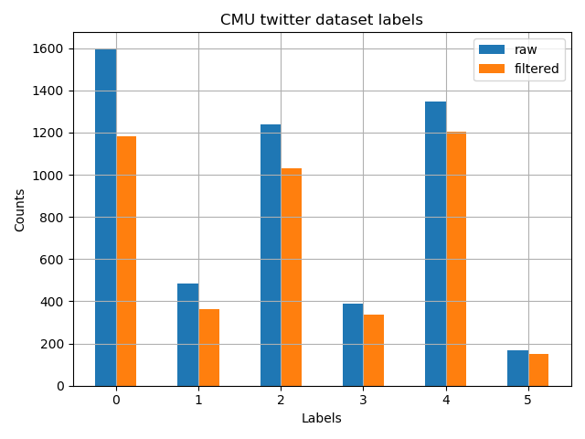
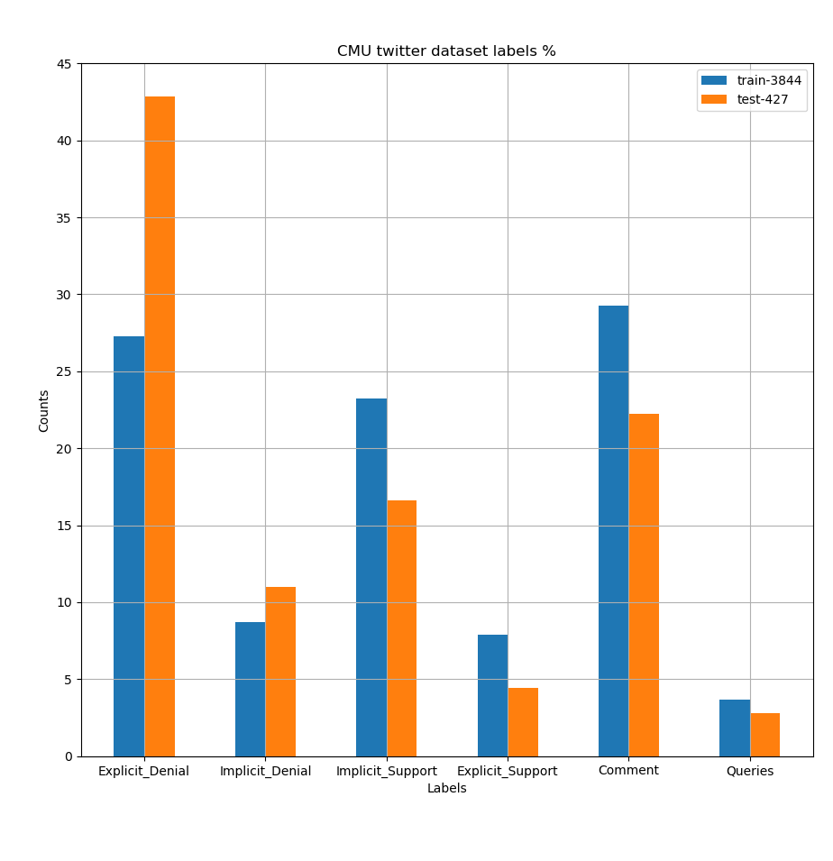
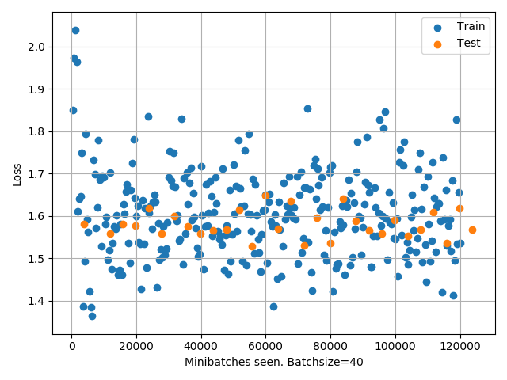
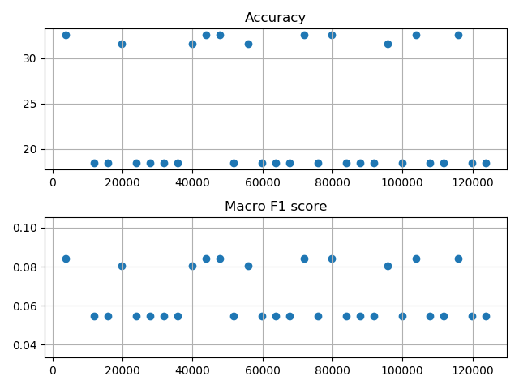
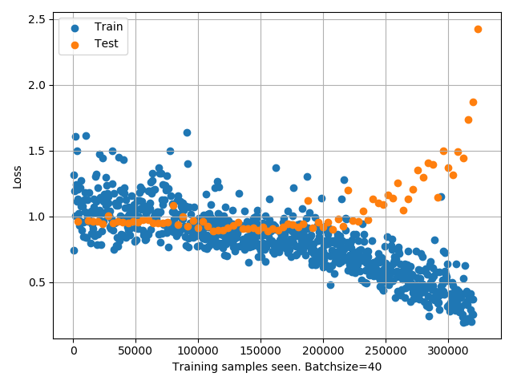
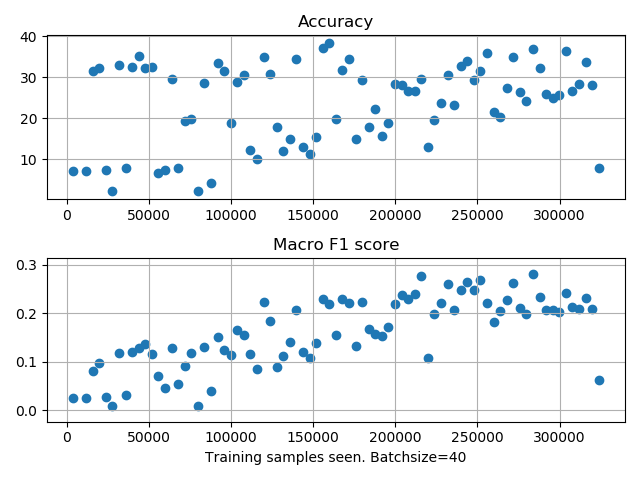
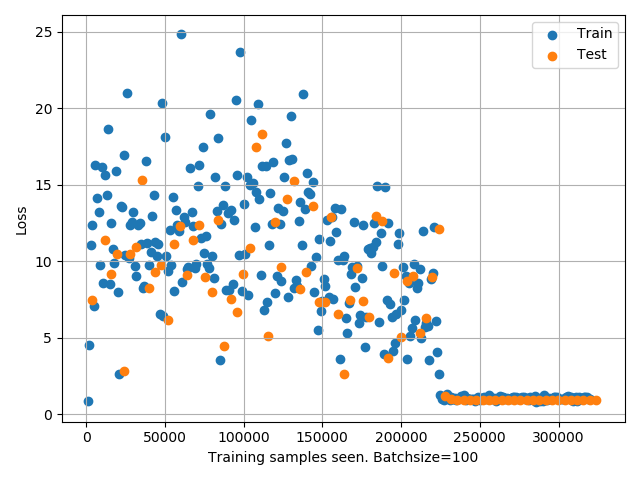
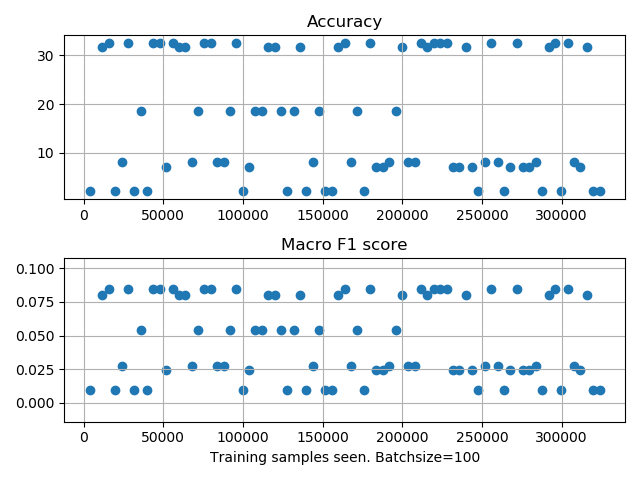
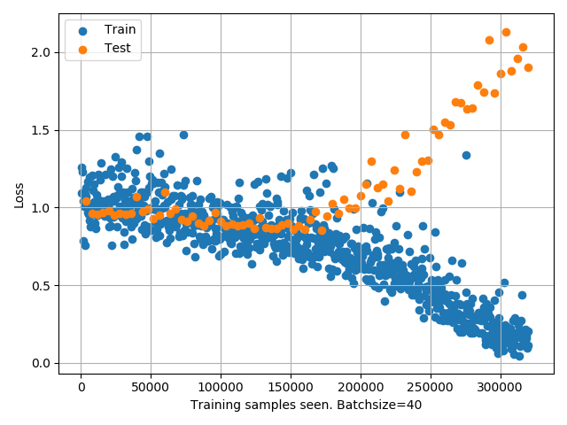
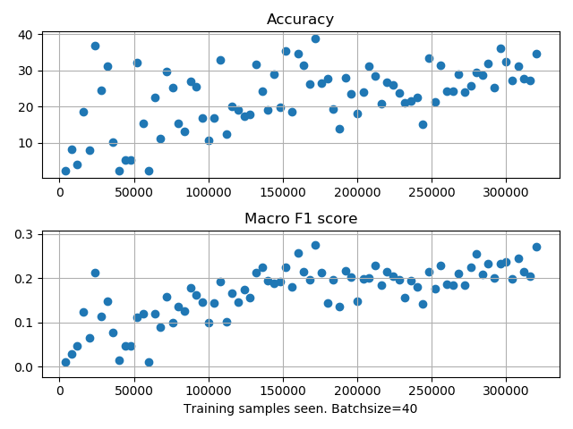

# TO DO LIST / RESULTS
    To try to learn how to classify tweet responses into the following categories
    0. Explicit Denial
    1. Implicit Denial
    2. Implicit Support
    3. Explicit Support
    4. Comment
    5. Queries
    
    Will try to use BERT to do the task    
    
## **Task 0: Preprocessing Data**
    [x] Visualize category labels density
    [x] Filter the NaNs in either parent tweet or child tweet
    [x] Tokenize tweet pairs
    [x] Convert labels into numbers
    [x] Split the dataset into training and test sets
    [x] Ensure test dataset label density is similar to main dataset's
    [x] Save the tokenized tweets into binaries    

### **Data:**
    Here's how the data looks like.

        
    There are 5221 tweet pairs in the raw data. 
    However, there are a lot of deleted tweets.
    There are 4271 tweet pairs in the cleaned data.
        ~90% training set (3844)
        ~10% test set (427)
    Always fix the test set as the last 427 samples

    After splitting into training and test sets, the densities still look OK.
    

## **Task 1: Try to classify using BERT**
    [x] Change the F1 metric to macro F1 score
    [x] Build a simple BERT first
    [x] Improve old code for saving training steps
    [x] Save intermediate models

## **Task 2: Try to improve classifier**
    [ ] Stack layers after generic BERT
    [ ] Use the bigger BERT model
    [x] Try ADAM instead of SGD
    [x] Weigh the cost function
    [x] Take care of URL, hashtag, mentions during tokenization
    [ ] Create modelB to incorporate reply/quote and times_labeled

### **Models:**

### ModelA0
    BERT ==> Dropout1 10% ==> Linear1
    Loss: Cross Entropy Loss, flat weights
    SGD lr=0.001, momentum=0.5
    Training takes ~1h for 30 epochs
    
### ModelA1
    BERT ==> Dropout1 10% ==> Linear1
    Loss: Cross Entropy Loss, 
        weights = sum_counts / (number of labels in each category),
        then divide by mean weight 
    SGD lr=0.001, momentum=0.5
    Training takes ~1h for 30 epochs
    
### ModelA2
    BERT ==> Dropout1 10% ==> Linear1
    Loss: Cross Entropy Loss, 
        weights = sum_counts / (number of labels in each category),
        then divide by mean weight 
    ADAM: lr=0.001, betas are defaults
    Training takes ~3h for 80 epochs

### ModelA3
    BERT ==> Dropout1 10% ==> Linear1
    Loss: Cross Entropy Loss, 
        weights = sum_counts / (number of labels in each category),
        then divide by mean weight 
    SGD lr=0.001, momentum=0.9
------------------------------------------------------------------
### ModelA4
    Same as A0 but with half the encoded token length.
    Squeeze in more examples per minibatch (n=100)
    
### ModelA5
    Same as A1 but with half the encoded token length.
    Squeeze in more examples per minibatch (n=100)
    
### ModelA6
    Same as A2 but with half the encoded token length.
    Squeeze in more examples per minibatch (n=100)

### ModelA7
    Same as A3 but with half the encoded token length.
    Squeeze in more examples per minibatch (n=100)
------------------------------------------------------------------
### ModelA8
    Same as A1 but dataset is cleaned of hashtags
    
### ModelA9
    Same as A2 but dataset is cleaned of hashtags

### ModelA10
    Same as A3 but dataset is cleaned of hashtags
------------------------------------------------------------------
### ModelB01
    BERT ==> Dropout1 10% ==> Linear1 ==> RELU1 ==> Dropout2 ==> Linear2
             Interaction  ==> 
    Loss: Cross Entropy Loss, flat weights
    SGD lr=0.001, momentum=0.5
    Training takes ~2.5h for 80 epochs
    
### ModelB01
    BERT ==> Dropout1 10% ==> Linear1 ==> RELU1 ==> Dropout2 ==> Linear2
             Interaction  ==> 
    Loss: Cross Entropy Loss, 
        weights = sum_counts / (number of labels in each category),
        then divide by mean weight 
    SGD lr=0.001, momentum=0.5
    Training takes ~2.5h for 80 epochs

### **Training algo:**
    If SGD was used, here are the parameters
        Learning rate = 0.001
        Momentum = 0.5
        Minibatch size = 40
    If ADAM was used, everything is default except LR
        Learning rate = 0.001

### **Hardware used:**
    GPU: RTX 2080 Super (8Gb RAM)
    CPU: Ryzen 3900 (12 cores 24 threads)
    1 epoch takes ~1.5 min for modelA
    Peak GPU RAM usage is ~7/8 Gb. Dont use maximum to give some buffer

### **Results:**

### ModelA0
    

    
    Remarks:
        The model doesn't really train at all. The output layer seems to swing 
        between results. It labels everything in 1 class or another. Perhaps this 
        is caused when it looks at a subset of training data from only 1 class. 
        Might be solved by either increasing momentum, increasing minibatch size, 
        or carefully tweaking the cost function.
        
### ModelA1

    
    Remarks:
        This works best so far. Loss starts to go down only a tiny bit @ 30 epochs. 
        Overfitting kicks in after 30 epochs.
    
### ModelA2
    Results not meaningful

### ModelA3
    Results not meaningful

------------------------------------------------------------------
### ModelA4
    Results not meaningful
    
### ModelA5

    
    The loss falls off a cliff at some point. It seems the model learnt to 
    just predict all results from the rarest class to game the loss.
    
    This one is interesting. The losses collapse at some point. 
    Upon inspecting the results, I see that the model just learnt to predict 
    the class with the weightage in the loss function. 
    Looks like the loss needs to be better designed.
    
### ModelA6
    Results not meaningful
    
### ModelA7    
    Results not meaningful
------------------------------------------------------------------
### ModelA8

    Interesting results. There seems to be overfitting if you view the loss.
    But the test accuracy and F1 scores are increasing. 
    
### ModelA9
    Results not meaningful
    
### ModelA10
    Results not meaningful

------------------------------------------------------------------
### ModelB00
    Results not meaningful

### ModelB01
    
    
### **Remarks:**

How to deal with abbreviations? Some examples
- NRA
- ROFL
- LOL
For some models, the raw texts are used. 
For others, there was precleaning. As an example, for this line of text

Original:
    .@ShuttleCDRKelly: "[The @NRA] is against background checks for gun sales - I mean, the most common sense thing that we can do to protect society they are so strongly against." https://t.co/DE0oENyL2S
    
Cleaned: 
    .[@ACCOUNT] "[The [@ACCOUNT] is against background checks for gun sales - I mean, the most common sense thing that we can do to protect society they are so strongly against." [URL]
    

# Concepts/tools used for this exercise
    The minibatch size is pushed to the max capacity of the GPU.
    Turn off everything else to avoid crashing the process.
    Chrome/spotifymicrosoft teams will grab GPU resources if they can